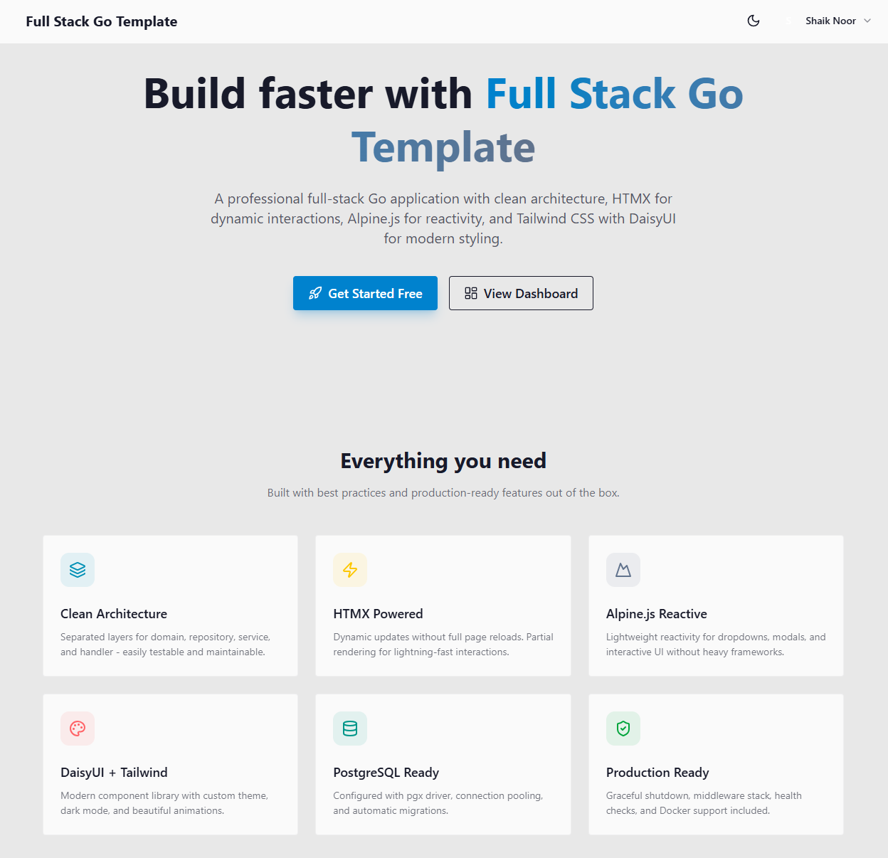
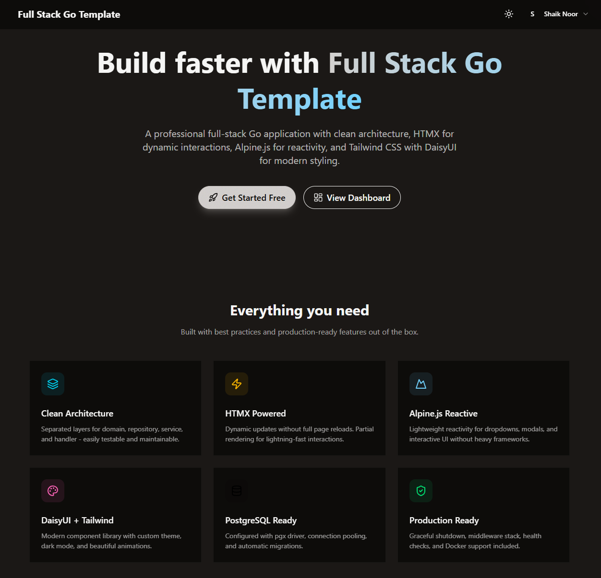

# Full Stack Go Template

A production-ready, full-stack Go web application template with modern frontend tooling, role-based authentication, and clean architecture.




## ✨ Features

### Backend
- **Go 1.23** with standard library HTTP server
- **PostgreSQL** database with automatic migrations
- **Clean Architecture** with handlers, services, and repositories
- **Role-Based Access Control** (User, Admin, Super Admin)
- **Session-based authentication** with secure cookie management
- **Graceful shutdown** with configurable timeouts

### Frontend
- **Tailwind CSS v4** with custom theming
- **DaisyUI v5** component library with light/dark mode
- **HTMX** for dynamic HTML updates without writing JavaScript
- **Alpine.js** for lightweight reactivity
- **Lucide Icons** for beautiful, consistent iconography

### Developer Experience
- **Docker support** with multi-stage builds
- **Docker Compose** for local PostgreSQL
- **Hot reload** development scripts (Windows/Linux/Mac)
- **Makefile** for common tasks
- **Vendor bundling** for all frontend dependencies

## 📁 Project Structure

```
├── cmd/
│   └── server/          # Application entry point
├── internal/
│   ├── config/          # Configuration loading
│   ├── domain/          # Business entities (User, Role, Session)
│   ├── handler/         # HTTP handlers
│   ├── middleware/      # Auth, CORS, Logging, Recovery
│   ├── repository/      # Data access layer (PostgreSQL)
│   └── service/         # Business logic layer
├── pkg/                 # Shared packages
├── scripts/             # Development scripts
├── web/
│   ├── static/          # CSS, JS, vendor files
│   └── templates/       # Go HTML templates
│       ├── components/  # Reusable UI components
│       ├── layouts/     # Base layouts
│       ├── pages/       # Page templates
│       └── partials/    # Template partials
├── Dockerfile           # Multi-stage production build
├── docker-compose.yml   # PostgreSQL service
└── Makefile             # Build automation
```

## 🚀 Quick Start

### Prerequisites

- **Go 1.23+**
- **Node.js 18+** (for Tailwind CSS)
- **Docker** (optional, for PostgreSQL)

### 1. Clone and Setup

```bash
git clone https://github.com/shaik-noor/full-stack-go-template.git
cd full-stack-go-template

# Copy environment file
cp .env.example .env
```

### 2. Start Database

```bash
# Using Docker (recommended)
docker-compose up -d

# Or configure DATABASE_URL in .env for your existing PostgreSQL
```

### 3. Install Frontend Dependencies

```bash
npm install
npm run build
```

### 4. Run the Application

```bash
# Development mode
go run ./cmd/server

# Or use the development script (includes file watching)
# Windows
.\scripts\dev.bat

# Linux/Mac
./scripts/dev.sh
```

Visit [http://localhost:3000](http://localhost:3000)

## 📋 Available Commands

### Makefile

```bash
make dev          # Run development server
make build        # Build production binary
make run          # Run built binary
make css          # Build Tailwind CSS (minified)
make css-watch    # Watch Tailwind CSS for changes
make db-up        # Start PostgreSQL container
make db-down      # Stop PostgreSQL container
make test         # Run tests
make clean        # Clean build artifacts
```

### NPM Scripts

```bash
npm run build       # Build CSS and copy vendor files
npm run watch       # Watch CSS for changes
npm run copy-vendor # Copy vendor files from node_modules
```

## 🔐 Authentication & Roles

The application includes a complete authentication system with three roles:

| Role | Permissions |
|------|-------------|
| **User** | Access to user dashboard |
| **Admin** | User management + admin dashboard |
| **Super Admin** | Full system access, can manage admins |

### Route Protection

- `/u/dashboard` - User dashboard (all authenticated users)
- `/a/dashboard` - Admin dashboard (Admin, Super Admin)
- `/s/dashboard` - Super Admin dashboard (Super Admin only)
- `/users/*` - User management (Admin, Super Admin)

## 🎨 Theming

The application supports **light** and **dark** modes using DaisyUI themes:

- **Light Mode**: `corporate` theme
- **Dark Mode**: `night` theme

Theme preference is:
- Stored in `localStorage` and cookies
- Toggled via the sun/moon button in the header
- Persisted across sessions

## ⚙️ Environment Variables

| Variable | Description | Default |
|----------|-------------|---------|
| `SERVER_PORT` | HTTP server port | `3000` |
| `SERVER_HOST` | Server bind address | `0.0.0.0` |
| `DATABASE_URL` | PostgreSQL connection string | - |
| `APP_ENV` | Environment mode | `development` |

## 🐳 Docker

### Build and Run

```bash
# Build production image
docker build -t full-stack-go-template .

# Run container
docker run -p 3000:3000 \
  -e DATABASE_URL="postgres://..." \
  full-stack-go-template
```

### Features

- Multi-stage build for minimal image size
- Non-root user for security
- Built-in health check endpoint (`/health`)
- Alpine-based for small footprint

## 🧪 API Endpoints

| Method | Path | Description | Auth Required |
|--------|------|-------------|---------------|
| `GET` | `/` | Home page | No |
| `GET` | `/health` | Health check | No |
| `GET` | `/signin` | Sign in page | No |
| `POST` | `/signin` | Authenticate user | No |
| `GET` | `/signup` | Sign up page | No |
| `POST` | `/signup` | Register user | No |
| `POST` | `/logout` | Log out | Yes |
| `GET` | `/dashboard` | Redirect to role dashboard | Yes |
| `GET` | `/users` | List users | Admin |
| `GET` | `/users/create` | Create user form | Admin |
| `POST` | `/users/create` | Create user | Admin |
| `GET` | `/users/{id}/edit` | Edit user form | Admin |
| `POST` | `/users/{id}/edit` | Update user | Admin |
| `DELETE` | `/users/{id}` | Delete user | Super Admin |

## 🛠️ Tech Stack

| Category | Technology |
|----------|------------|
| **Language** | Go 1.23 |
| **Database** | PostgreSQL 16 |
| **CSS Framework** | Tailwind CSS v4 |
| **UI Components** | DaisyUI v5 |
| **Interactivity** | HTMX + Alpine.js |
| **Icons** | Lucide |
| **Containerization** | Docker |

## 📄 License

This project is open source and available under the [MIT License](LICENSE).

## 🤝 Contributing

Contributions are welcome! Please feel free to submit a Pull Request.

1. Fork the repository
2. Create your feature branch (`git checkout -b feature/amazing-feature`)
3. Commit your changes (`git commit -m 'Add some amazing feature'`)
4. Push to the branch (`git push origin feature/amazing-feature`)
5. Open a Pull Request
