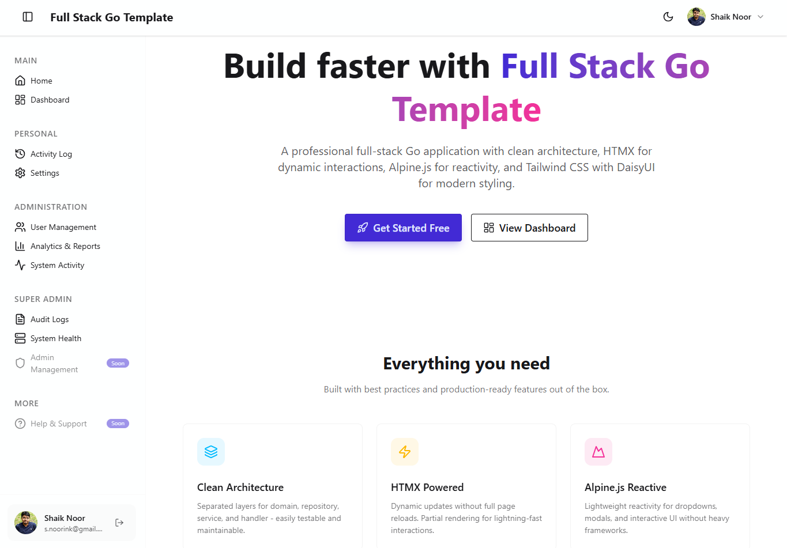
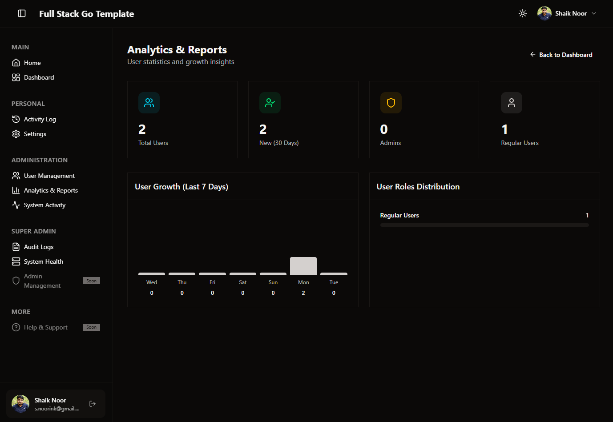
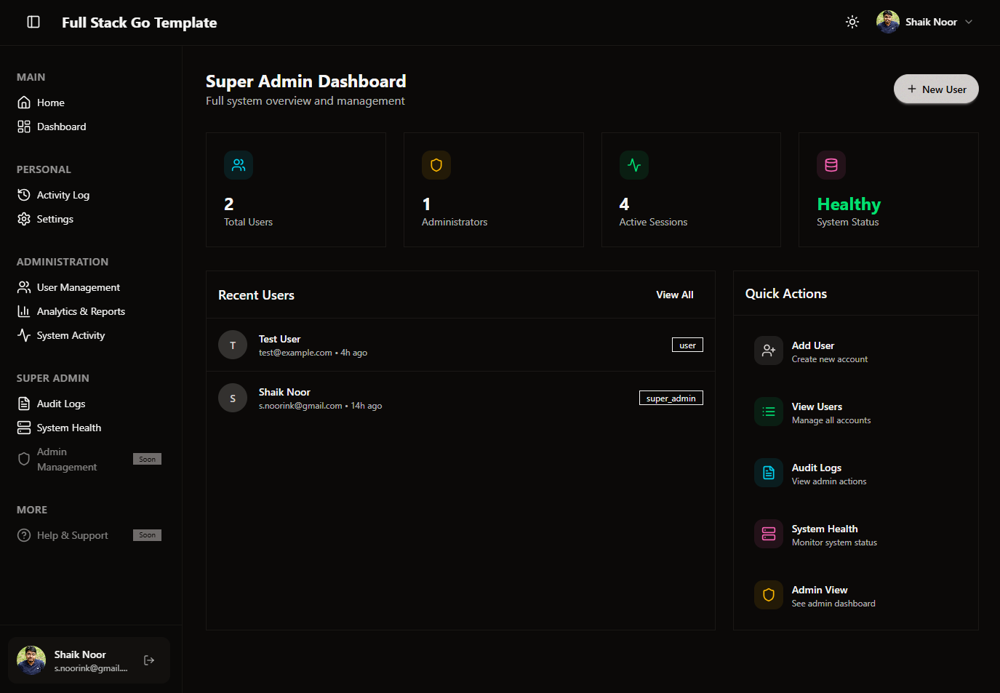

# Full Stack Go Template

A production-ready, full-stack Go web application template with modern frontend tooling, role-based authentication, and clean architecture.

## Screenshots

**Home**



**Admin Analytics**



**Super Admin Dashboard**



## ✨ Features

### Backend
- **Go 1.23** with standard library HTTP server
- **PostgreSQL** database with automatic migrations
- **Clean Architecture** with handlers, services, and repositories
- **Role-Based Access Control** (User, Admin, Super Admin)
- **Session-based authentication** with secure cookie management
- **Activity Logging** - Track user logins, profile updates with IP addresses
- **Audit Trail** - Complete logging of administrative actions for compliance
- **Analytics** - User growth tracking, role distribution, and system metrics
- **Graceful shutdown** with configurable timeouts

### Frontend
- **Tailwind CSS v4** with custom theming
- **DaisyUI v5** component library with light/dark mode
- **HTMX** for dynamic HTML updates without writing JavaScript
- **Alpine.js** for lightweight reactivity
- **Lucide Icons** for beautiful, consistent iconography

### Developer Experience
- **Docker support** with multi-stage builds
- **Docker Compose** for local PostgreSQL
- **Hot reload** development scripts (Windows/Linux/Mac)
- **Makefile** for common tasks
- **Vendor bundling** for all frontend dependencies

## 📁 Project Structure

```
├── cmd/
│   └── server/          # Application entry point
├── internal/
│   ├── config/          # Configuration loading
│   ├── domain/          # Business entities (User, Role, Session, ActivityLog, AuditLog)
│   ├── handler/         # HTTP handlers (Auth, User, Activity, Settings, Analytics, Audit)
│   ├── middleware/      # Auth, CORS, Logging, Recovery
│   ├── repository/      # Data access layer (PostgreSQL)
│   └── service/         # Business logic layer
├── scripts/
│   └── dev.js           # Cross-platform development server script
├── web/
│   ├── assets/
│   │   ├── css/         # Tailwind CSS source and output
│   │   └── vendor/      # Frontend dependencies (htmx, alpine, lucide)
│   └── templ/           # Templ templates
│       ├── components/  # Reusable UI components (navbar, sidebar, footer)
│       ├── layouts/     # Base layouts (main, auth)
│       └── pages/       # Page templates (dashboards, users, activity, analytics)
├── docs/                # Architecture documentation
├── .air.toml            # Air hot-reload configuration
├── Dockerfile           # Multi-stage production build
├── docker-compose.yml   # PostgreSQL + App services
└── package.json         # NPM scripts and dependencies
```

> 📖 For detailed architecture documentation, see [docs/ARCHITECTURE.md](docs/ARCHITECTURE.md)

## 🌍 For Developers from Other Languages

New to Go? Here's how this project maps to patterns you already know:

| This Project | Node.js/Express | Python/Flask | Java/Spring |
|--------------|-----------------|--------------|-------------|
| `cmd/server/main.go` | `app.js` | `app.py` | `Application.java` |
| `internal/handler/` | Route handlers | Flask routes | `@Controller` |
| `internal/service/` | Service classes | Service layer | `@Service` |
| `internal/repository/` | Database models | SQLAlchemy | `@Repository` |
| `internal/domain/` | TypeScript types | Pydantic models | Entity classes |
| `web/templ/` | React/EJS | Jinja2 | Thymeleaf |

**Quick Start Resources:**
- 📖 [Architecture Guide](docs/ARCHITECTURE.md) - Full project walkthrough
- 🚀 [Getting Started](docs/GETTING_STARTED.md) - Developer onboarding

## 🚀 Quick Start

### Prerequisites

- **Go 1.23+**
- **Node.js 18+** (for Tailwind CSS)
- **Docker** (optional, for PostgreSQL)

### 1. Clone and Setup

```bash
git clone https://github.com/shaik-noor/full-stack-go-template.git
cd full-stack-go-template

# Copy environment file
cp .env.example .env
```

### 2. Start Database

```bash
# Using Docker (recommended)
docker-compose up -d

# Or configure DATABASE_URL in .env for your existing PostgreSQL
```

### 3. Run the Application

```bash
# Development mode with hot-reload (cross-platform)
npm run dev
```

This single command will:
1. Install npm dependencies
2. Download Go modules  
3. Start Air (Go hot-reload) and Tailwind CSS watcher
4. Show timestamped, color-coded output for each process

Visit [http://localhost:3000](http://localhost:3000)

## 📋 Available Commands

### Makefile

```bash
make dev          # Run development server
make build        # Build production binary
make run          # Run built binary
make css          # Build Tailwind CSS (minified)
make css-watch    # Watch Tailwind CSS for changes
make db-up        # Start PostgreSQL container
make db-down      # Stop PostgreSQL container
make test         # Run tests
make clean        # Clean build artifacts
```

### NPM Scripts

```bash
npm run dev         # Start development server with hot-reload
npm run build       # Build for production (templ + CSS + Go binary)
npm run build:templ # Generate templ templates
npm run build:css   # Build and minify Tailwind CSS
npm run build:go    # Build Go binary
npm run watch:css   # Watch CSS for changes
```

## 🔐 Authentication & Roles

The application includes a comprehensive authentication system with three roles and role-specific features:

### Role Hierarchy

| Role | Permissions | Features |
|------|-------------|----------|
| **User** | Access to personal dashboard and settings | Activity log, profile settings, personal dashboard |
| **Admin** | User management + admin features | All user features + user management, analytics, system activity monitoring |
| **Super Admin** | Full system access | All admin features + audit logs, system health monitoring, admin management |

### User Features

**Routes**: `/u/*`

- **Personal Dashboard** (`/u/dashboard`) - Overview with profile card and quick links
- **Activity Log** (`/u/activity`) - Timeline of login/logout events, profile updates with IP tracking
- **Profile Settings** (`/u/settings`) - Update name, email, and account preferences

### Admin Features  

**Routes**: `/a/*`

- **Admin Dashboard** (`/a/dashboard`) - User statistics and recent activity overview
- **User Management** (`/a/users`) - Create, edit, and view all user accounts
- **Analytics** (`/a/analytics`) - User growth charts, role distribution, and detailed statistics
- **System Activity** (`/a/activity`) - Real-time feed of all user activities across the system

### Super Admin Features

**Routes**: `/s/*`

- **Super Admin Dashboard** (`/s/dashboard`) - System-wide overview with advanced statistics
- **Audit Logs** (`/s/audit`) - Complete trail of administrative actions for compliance
- **System Health** (`/s/system`) - Database status, server health, and configuration monitoring
- **Admin Management** - Promote/demote admin roles (accessible through user edit)

### Route Protection

- `/u/dashboard` - User dashboard (all authenticated users)
- `/a/dashboard` - Admin dashboard (Admin, Super Admin)
- `/s/dashboard` - Super Admin dashboard (Super Admin only)
- `/users/*` - User management (Admin, Super Admin)

## 🎨 Theming

The application supports **light** and **dark** modes using DaisyUI themes:

- **Light Mode**: `corporate` theme
- **Dark Mode**: `night` theme

Theme preference is:
- Stored in `localStorage` and cookies
- Toggled via the sun/moon button in the header
- Persisted across sessions

## ⚙️ Environment Variables

| Variable | Description | Default |
|----------|-------------|---------|
| `SERVER_PORT` | HTTP server port | `3000` |
| `SERVER_HOST` | Server bind address | `0.0.0.0` |
| `DATABASE_URL` | PostgreSQL connection string | - |
| `APP_ENV` | Environment mode | `development` |

## 🐳 Docker

### Docker Compose (Recommended)

```bash
# Start database and app together
docker-compose up --build

# Start in background
docker-compose up -d --build

# View logs
docker-compose logs -f app

# Stop everything
docker-compose down
```

### Build Manually

```bash
# Build production image
docker build -t full-stack-go-template .

# Run container
docker run -p 3000:3000 \
  -e DATABASE_URL="postgres://..." \
  -e AUTH_SECRET="your-secret" \
  full-stack-go-template
```

### Features

- Multi-stage build for minimal image size (~20MB)
- Non-root user for security
- Built-in health check endpoint (`/health`)
- Alpine-based for small footprint
- App waits for healthy database before starting

## 🧪 API Endpoints

### Public Routes

| Method | Path | Description | Auth Required |
|--------|------|-------------|---------------|
| `GET` | `/` | Home page | No |
| `GET` | `/health` | Health check | No |
| `GET` | `/signin` | Sign in page | No |
| `POST` | `/signin` | Authenticate user | No |
| `GET` | `/signup` | Sign up page | No |
| `POST` | `/signup` | Register user | No |
| `POST` | `/logout` | Log out | Yes |

### User Routes

| Method | Path | Description | Auth Required |
|--------|------|-------------|---------------|
| `GET` | `/u/dashboard` | User dashboard | User |
| `GET` | `/u/activity` | Activity log | User |
| `GET` | `/u/settings` | Profile settings | User |
| `POST` | `/u/settings` | Update profile | User |

### Admin Routes

| Method | Path | Description | Auth Required |
|--------|------|-------------|---------------|
| `GET` | `/a/dashboard` | Admin dashboard | Admin |
| `GET` | `/a/users` | List users | Admin |
| `GET` | `/a/users/create` | Create user form | Admin |
| `POST` | `/a/users/create` | Create user | Admin |
| `GET` | `/a/users/{id}/edit` | Edit user form | Admin |
| `POST` | `/a/users/{id}/edit` | Update user | Admin |
| `DELETE` | `/a/users/{id}` | Delete user | Super Admin |
| `GET` | `/a/analytics` | User analytics & reports | Admin |
| `GET` | `/a/activity` | System activity feed | Admin |

### Super Admin Routes

| Method | Path | Description | Auth Required |
|--------|------|-------------|---------------|
| `GET` | `/s/dashboard` | Super admin dashboard | Super Admin |
| `GET` | `/s/audit` | Audit logs | Super Admin |
| `GET` | `/s/system` | System health monitoring | Super Admin |

### Legacy Routes

| Method | Path | Description |
|--------|------|-------------|
| `GET` | `/dashboard` | Redirects to role-appropriate dashboard |
| `GET` | `/login` | Redirects to `/signin` |

## 🛠️ Tech Stack

| Category | Technology |
|----------|------------|
| **Language** | Go 1.23 |
| **Database** | PostgreSQL 16 |
| **CSS Framework** | Tailwind CSS v4 |
| **UI Components** | DaisyUI v5 |
| **Interactivity** | HTMX + Alpine.js |
| **Icons** | Lucide |
| **Containerization** | Docker |

## 📄 License

This project is open source and available under the [MIT License](LICENSE).

## 🤝 Contributing

Contributions are welcome! Please feel free to submit a Pull Request.

1. Fork the repository
2. Create your feature branch (`git checkout -b feature/amazing-feature`)
3. Commit your changes (`git commit -m 'Add some amazing feature'`)
4. Push to the branch (`git push origin feature/amazing-feature`)
5. Open a Pull Request
